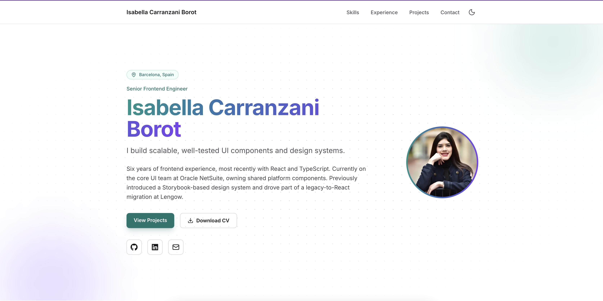

# Portfolio

Personal portfolio and interactive CV for Isabella Carranzani Borot, a frontend engineer.

**Live site:** https://portfolio-isa-8478.vercel.app



## Stack

- Next.js (App Router), React, TypeScript
- Tailwind CSS
- Lucide React and react-icons for icons
- Resend, called from a Next.js Server Action, for the contact form
- Deployed on Vercel

## Features

- All content lives in one typed data file, so no component code changes when the CV changes
- Class-based dark mode with the preference saved to `localStorage` and no theme flash on load
- Contact form with server-side validation, a honeypot field, and the API key kept server-side
- Responsive layout with an accessible mobile menu
- Scroll animations in plain CSS, disabled when the user prefers reduced motion
- Open Graph preview image and favicon generated in code

## Getting started

```bash
npm install
cp .env.example .env.local   # then fill in the values
npm run dev
```

Open http://localhost:3000.

### Environment variables

| Variable             | Purpose                                                |
| -------------------- | ------------------------------------------------------ |
| `RESEND_API_KEY`     | Resend API key (server-side only)                      |
| `CONTACT_TO_EMAIL`   | Inbox that receives contact messages                   |
| `CONTACT_FROM_EMAIL` | Sender address; must be on a domain verified in Resend |

Never commit `.env.local`.

## Editing the content

- Content: `src/data/portfolioData.ts`
- Types: `src/types/`
- Components: `src/components/`

## Scripts

```bash
npm run dev     # development server
npm run lint    # ESLint
npm run build   # production build
```

## Known limitations

- The contact form has no rate limiting beyond the honeypot.
- The theme has no separate "system" option once a user toggles it manually.
